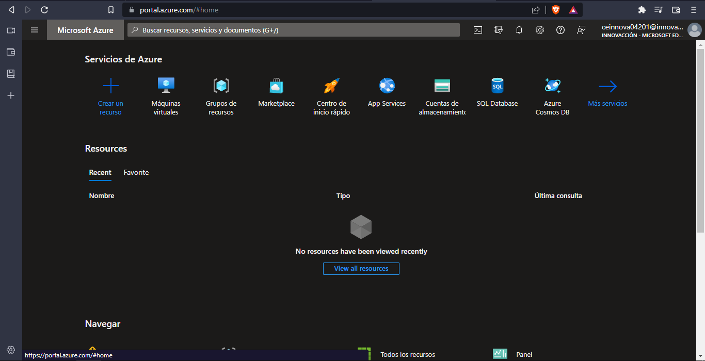

# Practica 1 - Azure-WordPress

## Objetivos 🥅

Al finalizar esta practica contaras con: 
- Una aplicacion web creada en WordPress por medio del servicio Azure de Microsoft.

## Paso 1 - Inicio de seccion en Azure

Ingresa a la página [portal.azure.com](https://portal.azure.com/) y posteriormente inicias seccion, una vez iniciada la seccion estaras en la siguiente pestaña:

## Paso 2 - Buscar el servicio de WordPress

Te dirigiras al Marketplace de Azure y buscaras WordPress, y seleccionaras el primer resultado, que es por medio de App Services.

Luego precionaras en Crear.

## Paso 3 - Crear el WordPress
Una vez estemos en el apartado para crear el WordPress, tendremos que ingresar los siguientes datos:

### *Suscripcion*
Seleccionar la suscripcion que deses usar, en mi caso usare "Azure for Students".

### *Grupo de Recursos*
Aqui seleccionaras un grupo de recursos, en dado caso de no tener uno haras lo siguiente.
Precionaras en "Crear nuevo" y le asignaras el nombres que quieras que tenga el grupo de resucrsos.

### *Region*
En el apartado de region Seleccionas la region que creas mas conveniente, se recomienda que sea la region en la cual estaran tus usuarios.

### *Nombre*

Aqui seleccionas el nombre que quieras que tenga la aplicacion web.

### *Sistema Operativo*

Por ultimo sleccionaras el sistema operativo que te convenga mas.

*Una vez llenos todos los apartadods precionaremos en siguiente*

### *Etiquetas*

El apartado de etiquetas es opcional, estas te sirven para tres cosas:

* Sacar reportes de costos.
* Cumplir normativas de seguridad.
* Dar mas informacion a quien utilize azure.

Para continuar precionaras en el boton que dice siguiente.

### *Revisar y Crear*

En este apartado Azure revisara que tengas todo bien y te mostrara lo siguinete:

Y por ultimo le precionamos el boton de crear y empezara a crearse.

## Paso 4 - Poner en Funcion la Aplicacion Web

Una vez terminada la creacion del WordPress, precionamos el boton de ir al recurso.

Una vez en el recuso damos clik en la parte que dice URL.

Una vez ingresemos a la URL nos abrira una nueva ventana en la que nos mostrara un formulario el cual llenaremos con las caracteristicas que queremos tenga nuestro citio web.

Una vez lleno damos clik en Instalar WordPress

Y con esto tenemos Finalizada nuestra aplicacion web en Azure.
